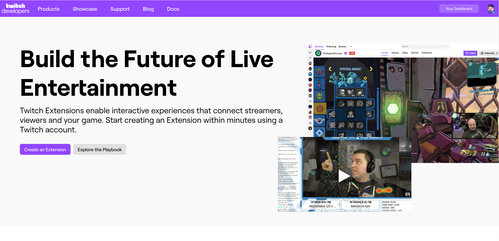
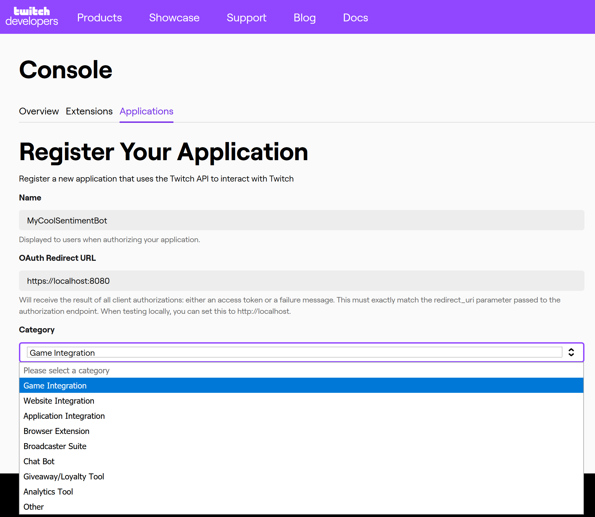
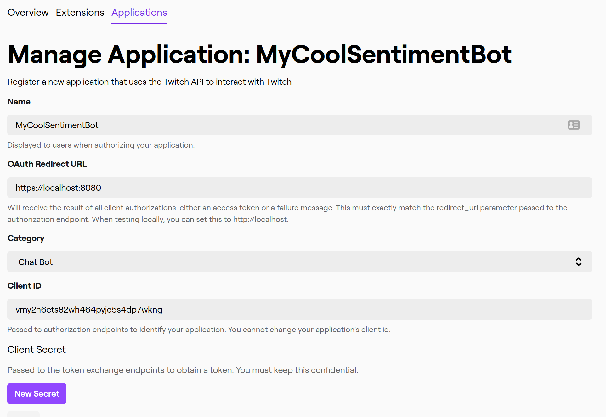

# Get Started

In this warm-up session, you will:

 + Install the tools needed to be able to build and learn about Chat Bots and Twitch extensions
 + Explore the Twitch Developer Portal
 + Create your first Twitch Application

## Setup

We recommend you choose a rich code editor like [Visual Studio Code](https://code.visualstudio.com) to allow you flexibility in the languages and tools that you use, as well as the rich helper functionality to make you productive.  You are welcome to use any text editor to work with this content.

The code for the bot has been written and tested with [.NET Core 3](https://dot.net) and [Node 10.16](https://nodejs.org).

## The Twitch Developer Portal

The developer platform for Twitch is accessed at https://dev.twitch.tv  From here, you will be able to define applications and extensions as well as find documentation for all of the APIs on the platform.

## Create your first Twitch Application

Twitch applications are identified by the Twitch platform that are granted access to be able to work with the APIs through the use of a ClientID and Client Secret value.  To be able to register your application for integration with Twitch, you first need a Twitch login.  

Next, you need to register and login with your Twitch account at https://dev.twitch.tv  

Click the 'Your Dashboard' button in the top right to see your registered extensions and applications.  Choose the 'Applications' tab at the top of the dashboard to see the list of current applications.

Click the 'Register Your Application' button to enter the following screen where you will define your Chat Bot:

Key in a great name for your chat bot, enter an OAuth Redirect URL of `https://localhost:8080` (a bogus address that we will not be using for this application), and choose a category of "Chat Bot".  You can see all of the different application categories in the category drop down, and this could inspire you to build one of these types of integrations in the future.  Click the 'Create' button below the Category drop-down box, and your application will be created.

You will then be presented with the dashboard of applications again.  Locate the application you just created and click the 'Manage' button next to it to get more information about the application.

Your Client ID and Client Secret are available from this screen.  The Client ID is a unique identifier for your application and can be shared publicly.  It helps Twitch understand what your application is doing, and allows them to contact you if it is not behaving within the constraints set by Twitch.  The Client Secret is your application's "password" to access the Twitch APIs and platform.

Write down the Client ID presented here and click the 'New Secret' button.  This will generate a Client Secret and present it to you.  You will NOT be able to see it again after you navigate away from this screen, and will need to generate a new Client Secret if you lose it.  You should copy the Client Secret to a secure location, but for this chat bot, we will not be using the Client Secret.

Congratulations!  You have now created your first Twitch Application.