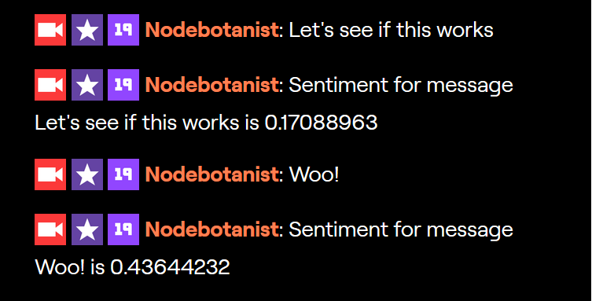

# Node Sentiment ChatBot -- FINAL

## Setup

Using your command line tool, inside this folder (`final/node-sentimentbot`), run

```
$ npm i
```

Then, create a `.env` file that looks like this:

```
BOT_USERNAME="(your username)"
OAUTH_TOKEN="(your oauth token)"
CHANNEL_NAME="(your username)"
```

Finally, run it with

```
$ node index.js
```

And try putting messages into your chat:

